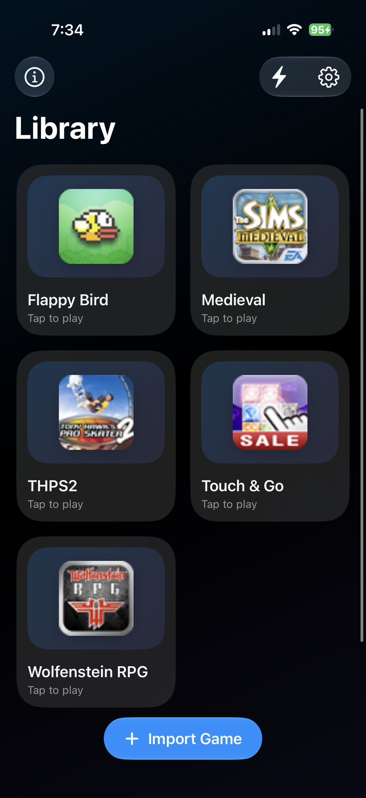
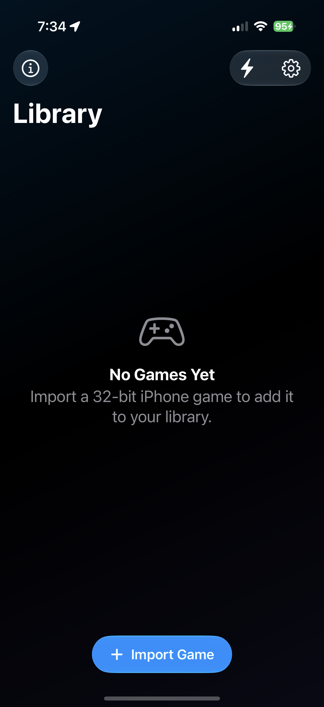
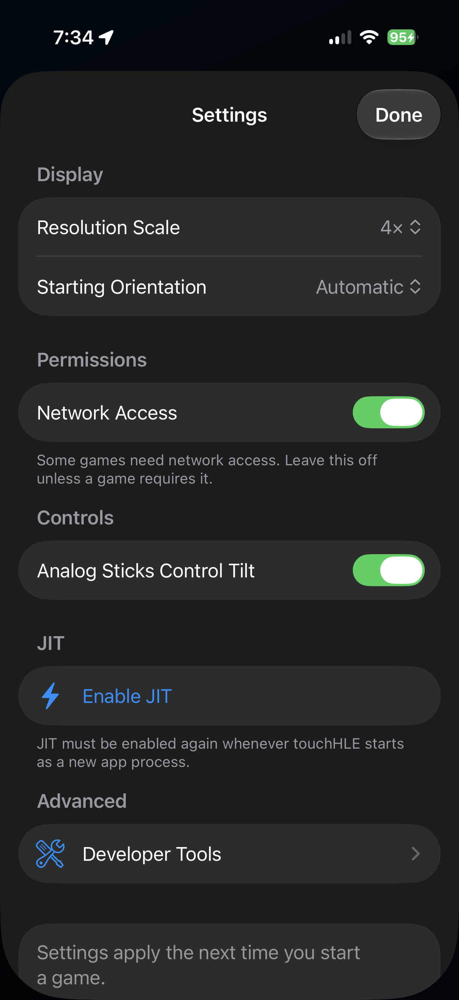
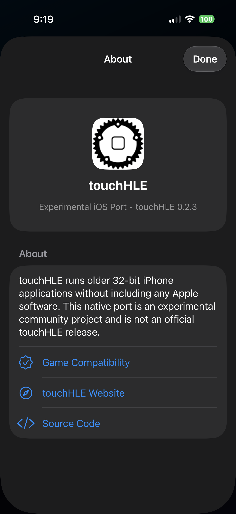

# touchHLE iOS Port

> [!IMPORTANT]
> This is an experimental, unofficial iOS port based on the touchHLE 0.2.3 development line at upstream commit `6bce4119`. It is not an official touchHLE release and is not endorsed by the upstream project.

Run supported older 32-bit iPhone games on a modern iPhone through touchHLE's existing high-level emulation. This fork adds a native SwiftUI library, IPA importing, guest artwork, persistent saves and settings, game-aware orientation handling, and an in-game return control.

**[Download the unsigned IPA](https://github.com/johnny901901901/touchHLE/releases/tag/ios-v0.1.0)** · **[Installation and JIT guide](platform/ios/README.md#install-the-unsigned-ipa)** · **[Troubleshooting](platform/ios/README.md#troubleshooting)** · **[Compatibility database](https://appdb.touchhle.org/)**

## Screenshots

<table>
  <tr>
    <td></td>
    <td></td>
  </tr>
  <tr>
    <td></td>
    <td></td>
  </tr>
</table>

Imported titles shown in screenshots are not included and are not all compatibility claims.

## Current Status

| Item | Status |
| --- | --- |
| iOS port version | 0.1.0 |
| touchHLE base | 0.2.3 development line (`6bce4119`) |
| Minimum deployment target | iOS 17.4 |
| Tested device | iPhone 16 Pro |
| Tested system | iOS 27 beta 4 |
| CPU backend | Dynarmic |
| JIT | Required whenever the app starts as a new process |
| Games | Not included; legally obtained decrypted 32-bit IPAs are required |

Confirmed on the tested device:

- Touch & Go.
- Tony Hawk's Pro Skater 2.
- Wolfenstein RPG.

Other modern iPhones and supported iOS versions need wider testing. A high rating in the touchHLE compatibility database is the best place to begin, but it does not guarantee that the same game version has already been tested through this iOS port.

The Sims Medieval is a future compatibility target and is not currently claimed working.

## Features

- Native Apple-style game library and settings interface.
- IPA importing with guest app names and icons.
- Persistent settings and per-game save folders.
- Guest-aware portrait and landscape launching.
- Red in-game exit control for returning to the library.
- StikDebug shortcut for enabling JIT.
- Optional FPS counter under **Settings → Advanced → Developer Tools**.

## Installation

The release IPA is deliberately unsigned and contains no Apple account, certificate, provisioning profile, team ID, device identifier, games, or saves. Each user signs it locally with their own Apple account.

### AltStore Classic

1. Install [AltStore Classic](https://altstore.io/) and complete its normal AltServer setup.
2. Download `touchHLE-iOS-unsigned.ipa` from [GitHub Releases](https://github.com/johnny901901901/touchHLE/releases/tag/ios-v0.1.0).
3. In AltStore, open **My Apps**, tap **+**, and select the IPA.
4. Enable JIT before starting a game.

Free Apple accounts normally require the app to be refreshed every seven days. A paid Apple Developer account provides longer-lived development signing but does not remove the JIT requirement.

### Xcode

The app can also be built and installed directly with Xcode using a free Personal Team or paid developer account. Follow the [complete Xcode instructions](platform/ios/README.md#option-b-build-and-install-with-xcode).

## JIT Is Required

Installing the app is not enough by itself. The current Dynarmic backend requires JIT, which must be enabled again whenever touchHLE starts as a new process.

Supported approaches include:

- [StikDebug](https://github.com/StephenDev0/StikDebug) with LocalDevVPN and a private device pairing file.
- [AltJIT](https://faq.altstore.io/altstore-classic/altjit) through AltStore Classic.

See the [complete JIT setup and troubleshooting guide](platform/ios/README.md#enable-jit). Never upload or share pairing files, certificates, provisioning profiles, signed IPAs, or device backups.

## Importing Games

1. Open touchHLE and tap **Import Game**.
2. Select a legally obtained decrypted 32-bit `.ipa` from Files.
3. Check the [touchHLE compatibility database](https://appdb.touchhle.org/) for the exact app version.
4. Enable JIT and tap the imported game card.

This project does not provide games, decrypted executables, encryption keys, or instructions for bypassing copy protection.

## Saves

Game progress is stored inside the app container under:

```text
Documents/touchHLE_sandbox/<guest-bundle-id>
```

Saves survive returning to the library and normal app restarts. Deleting touchHLE can delete its entire app container, so back up `touchHLE_sandbox` through the Files app first.

## Build From Source

Building requires macOS, Xcode 26 or newer, stable Rust, CMake, Ninja, and Boost headers. The release build can be produced from the repository root with:

```sh
sh platform/ios/scripts/build-host.sh iphoneos Release
sh platform/ios/scripts/package-ipa.sh
```

See the [complete prerequisites and build instructions](platform/ios/README.md#build-from-source) before building or distributing an IPA.

## Limitations

- There is no no-JIT ARM interpreter in this fork.
- Device and iOS-version coverage remains limited.
- Some games still require touchHLE compatibility work.
- This is an early sideloaded test build, not an App Store release.

## Upstream And Credits

The emulator itself is the work of the [touchHLE project contributors](https://github.com/touchHLE/touchHLE/graphs/contributors). This fork adds the experimental native iOS port and iOS-specific integration fixes.

- [Official touchHLE website](https://touchhle.org/)
- [Upstream touchHLE source](https://github.com/touchHLE/touchHLE)
- [Full iOS port documentation](platform/ios/README.md)

Thanks also to [u/WorriedEquipment2241](https://www.reddit.com/user/WorriedEquipment2241/) for publicly demonstrating a separate touchHLE experiment on a jailbroken iPhone. That demonstration helped establish the idea's viability; this fork does not claim to contain source from that unreleased experiment.

touchHLE source is licensed under MPL-2.0. Binary distribution is covered by GPL-3.0-or-later due to dependency licensing. Preserve the repository's existing licenses and attribution. This project is not affiliated with Apple.
